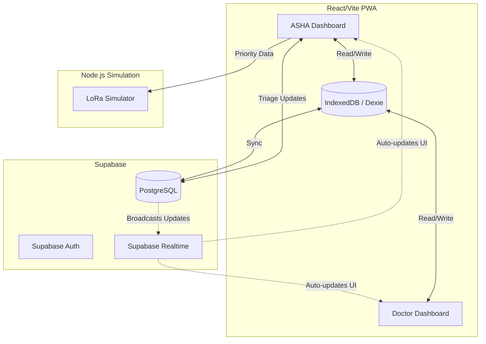

# System Design & Architecture

## High-Level Architecture

## Component Architecture

1. **Frontend (React):** Handles UI rendering. Uses `dexie` for local storage and `@supabase/supabase-js` for backend communication.
2. **Realtime Sync Layer:** Listens to Supabase channels on the `visits` table to reorder queues on the fly.
3. **Offline Sync Manager:** Monitors `window.navigator.onLine`. Queues failed requests in IndexedDB and replays them when connectivity returns.

## Development & Collaboration Workflow (Multi-Agent/Multi-User)

Since 3 teammates are working concurrently with their own AI agents on separate devices, we must maintain strict Git hygiene for context sharing:

1. **Branching Strategy:** 
   - `main`: The stable integration branch.
   - `feat/asha-dashboard`, `feat/doc-dashboard`, `feat/offline-sync`, etc.
2. **Context Sharing Loop:**
   - Agent completes a task -> Commit -> Push to remote feature branch (or `main` if agreed).
   - Other teammates run `git pull` before starting new tasks to ensure their local agents have the latest repository context.
3. **Contract Adherence:**
   - Agents MUST NOT change `API_SPEC.md` or `DATABASE.md` without cross-team agreement. These files act as the shared truth allowing parallel work.
